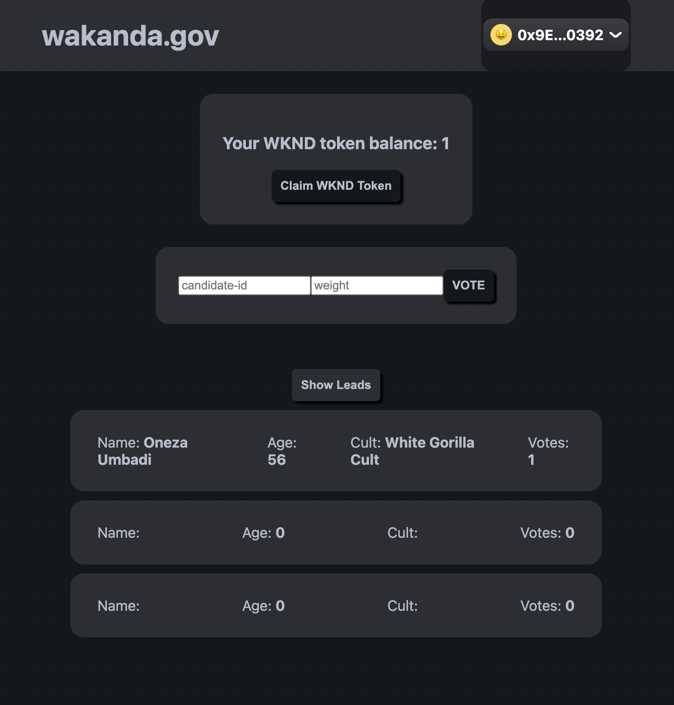

# wakanda.gov

deployed app: https://mvp-app.vercel.app/

## front page



## Getting Started

First, run the development server:

```bash
npm run dev
# or
yarn dev
```

Open [http://localhost:3000](http://localhost:3000) with your browser to see the result.
